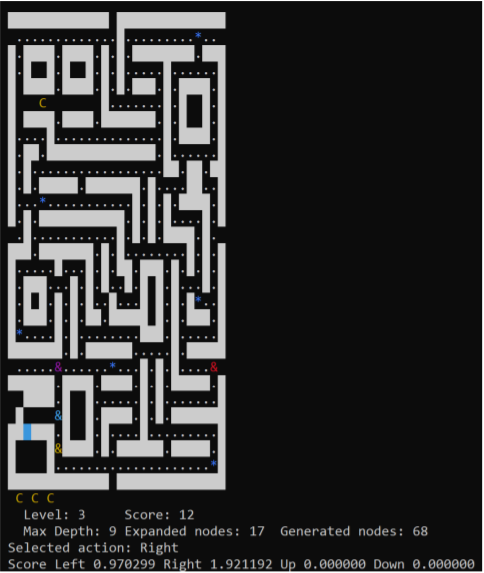

# Create an AI agent to play Pacman, using implementation of Dijkstra's algorithm and heuristics

For this project, I will be implementing Dijkstra's algorithm, create an AI agent to play the game Pacman.

## How Pacman works
For how to play, see [Pacman Wikipedia](https://en.wikipedia.org/wiki/Pac-Man)

An AI agent or human player can change the direction of Pac-Man movements

## How my AI works

### Implementation
The AI that I created will be applied to the base gaming code, adapted from the open-source terminal version made available by
[Mike Billars](https://sites.google.com/site/doctormike/pacman.html) and the original version can be installed as a standard package in [Ubuntu](https://packages.ubuntu.com/xenial/games/pacman4console).

### Algorithm
The Pac-Man Graph G = {V, E} is implicitly defined. The vertex set V is defined as all the possible configurations (states),
and the edges E connecting two vertexes are defined by the legal movements (right, left, up, down).

The AI agent will use a variant of Dijkstra to find the most rewarding path for a provided maximum budget of the expanded nodes.
For every step, find the highest score return of the available moves and execute that move. For ties, they will be broken randomly.

**Reward of a step is caclulated by `r(n) = (h(n) + score(n) − score(nParent)) * pow(discountFactor, depth)`**
* h(n): The heuristic function is h(n) = i − l − g, where i = 10 if Pac-Man has eaten a fruit and becomes invincible in that state; l = 10 if a life has been lost in that state; and g = 100 if the game is over. Otherwise i = l = g = 0.
* score(n) − score(nParent): The change in score between the current node and the parent node.

**The predicted score of each movement will be calculated using all of the r-values of the movement node and its children. There are two ways to do this:**
* max: adds up all of the rewards, stops when a move leads to a life lost.
* avg: compute the average of the rewards, that is, the total reward divided by the number of the movement node's children.

## Additional improvements

### Algorithm improvement
The previous implementation can make the AI less deterministic when going in empty areas (equal score for all available steps), making it likely to oscillates around. So to make it more deterministic, I have added a further tie break logic to avoid the AI to repeat its route, set on priorities:
1. The movement is prependicular to the old move (Random tie break in case of 2 available prependicular moves).
2. If no prependicular movement is available, do not change direction.

To be able to implement this, the base code is also been **modified** to accept more inputs.

### Lazy conversion
Since the default is a `.txt` report that has many paragraphs that takes a lot of time to copy into a result table, I have also written a Java operation to convert the report into a `.csv` table. See `ReadToCsv.java`.

## Initial result
[Report for 1st version](https://github.com/tuankhoin/pacman-AI-agent/blob/master/Assignment2_Experiment.pdf)

*Initial problem has been detected. The node priority is not set correctly. Fixed!*
